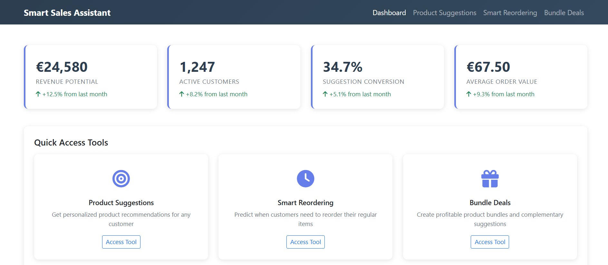
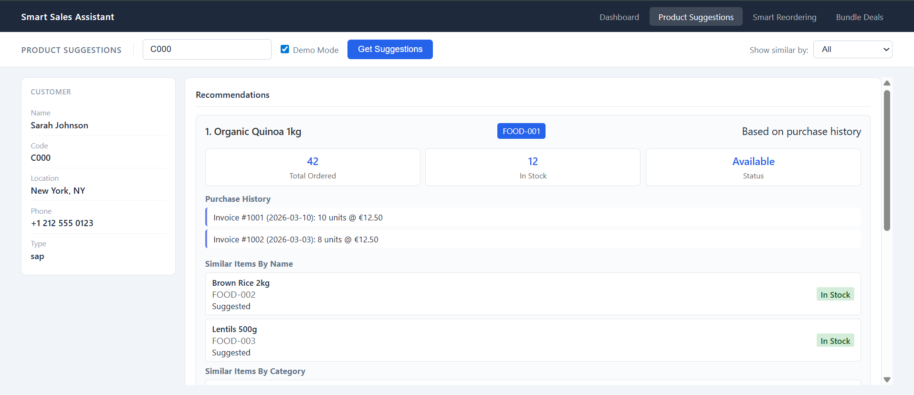
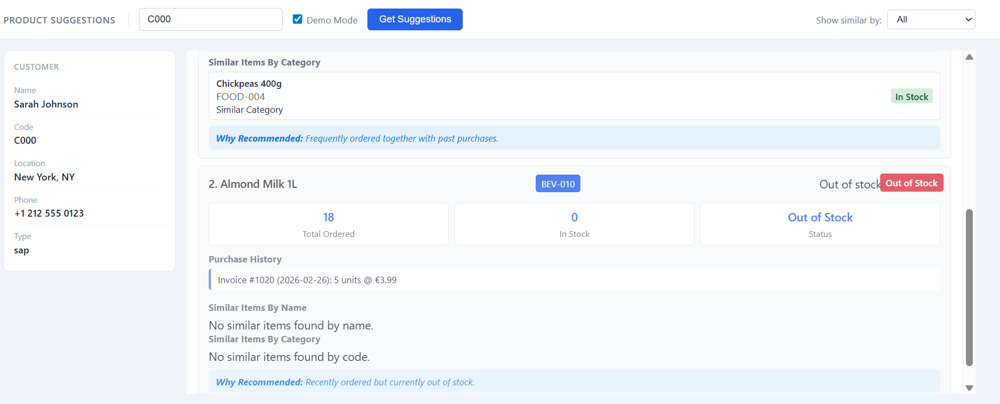
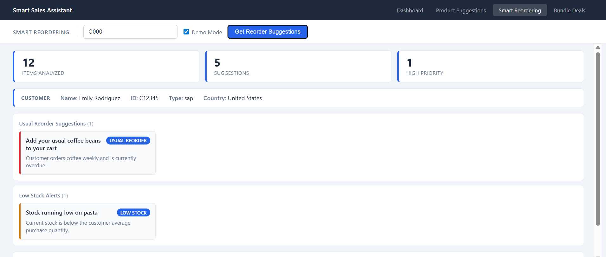
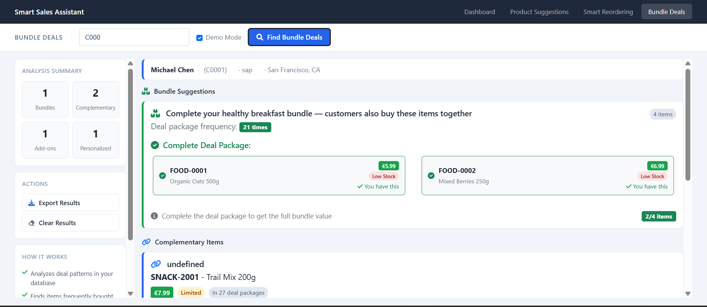

## Project Overview

> AI Sales Agent is a comprehensive sales intelligence platform that leverages machine learning and data analysis to provide actionable insights for food delivery operations. The system analyzes customer purchase patterns, inventory data, and product relationships to deliver personalized recommendations that increase customer satisfaction and revenue.

---

---
## Target Users

- **Food Delivery Businesses**: Companies managing SAP-based operations
- **Sales Teams**: Customer service representatives and sales associates
- **Operations Managers**: Inventory and supply chain managers
- **Business Analysts**: Data-driven decision makers

---
## Features

### 1. **Personalized Product Recommendations**
Suggests relevant products based on customer's purchase history
   - **Algorithm**: 
        - Extract all invoices for customer (last 365 days)
        - Filter out zero-quantity items (returns/exchanges)
        - Build comprehensive purchase profile
        - Name-based similarity (regex pattern matching)
        - Code-based similarity (item code patterns)
        - Category-based similarity (ItemsGroupCode grouping)
        - Check real-time stock availability
        - Prioritize based on stock levels
   
   - **Data Sources**: Customer invoices, item catalog, inventory levels
   - **Output**: Ranked list of recommended products with availability status

  

---

### 2. **Predictive Ordering System**
PPredicts when customers should reorder items based on historical patterns
   - **Algorithm**: 
        - Group orders by ItemCode
        - Calculate intervals between consecutive orders
        - Compute statistical measures (mean, median, std dev)
        - Filter patterns within 7-90 day range
        - Require minimum 2 orders for analysis
        - Validate consistency thresholds
        - Overdue Analysis: avg_interval + 3 to +10 days
        - Stock Threshold: 2x average order quantity
        - Priority Classification: High/Medium based on urgency

   - **Output**: Smart cart suggestions with priority levels

---

### 3. **AI-Driven Upselling & Cross-Selling**
Increases average order value through intelligent product bundling
   - **Algorithm**: 
        - Extract multi-item deals from database
        - Calculate item co-occurrence frequencies
        - Build association matrices
        - Bundle Completion: Missing items from popular bundles
        - Complementary Items: Frequently co-purchased products
        - Popular Add-ons: High-frequency items across customers
        - Minimum frequency thresholds (2+ occurrences)
        - Stock availability validation

   - **Strategies**: Bundle completion, complementary items, popular add-ons
   - **Output**: Revenue-optimized product suggestions

---

## Tech Stack

| Category | Technology / Tool | Use Case |
| :--- | :--- | :--- |
| **Backend** | Flask | Primary web framework |
| | MongoDB Atlas | Cloud-hosted database |
| | PyMongo | Database driver and authentication |
| | RESTful API | JSON-based communication |
| **Frontend** | JavaScript (ES6+) | Logic for dynamic user interactions |
| | AJAX (Fetch/XHR) | Seamless, asynchronous API calls |
| | Bootstrap | Responsive UI components and styling |
| **Data & Core** | `pymongo` | MongoDB connectivity |
| | `datetime` | Precise date/time handling |
| | `collections` | Frequency analysis using `Counter` |
| | `difflib` | Text similarity with `SequenceMatcher` |
| | `statistics` | Mathematical and statistical operations |
| | `json` | Data serialization and storage |

---
